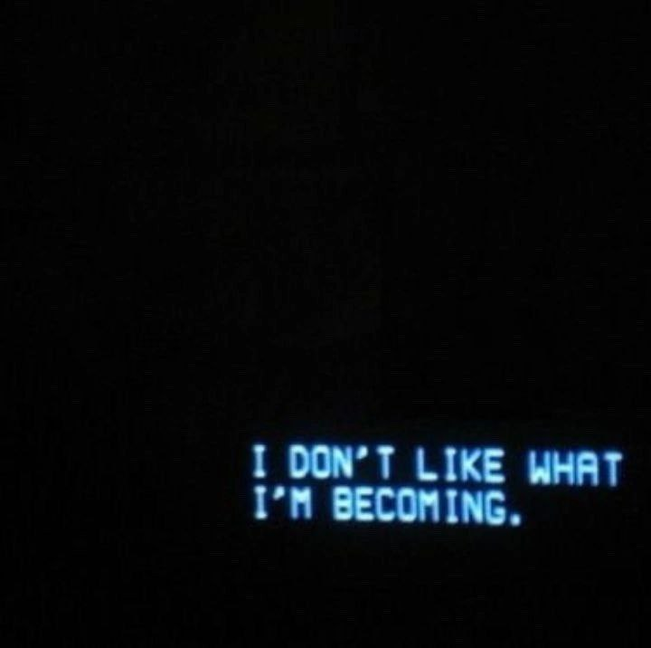

<p align = "center">МИНИСТЕРСТВО НАУКИ И ВЫСШЕГО ОБРАЗОВАНИЯ<br>
РОССИЙСКОЙ ФЕДЕРАЦИИ<br>
ФЕДЕРАЛЬНОЕ ГОСУДАРСТВЕННОЕ БЮДЖЕТНОЕ<br>
ОБРАЗОВАТЕЛЬНОЕ УЧРЕЖДЕНИЕ ВЫСШЕГО ОБРАЗОВАНИЯ<br>
«САХАЛИНСКИЙ ГОСУДАРСТВЕННЫЙ УНИВЕРСИТЕТ»</p>
<br><br><br><br><br><br>
<p align = "center">Институт естественных наук и техносферной безопасности<br>Кафедра информатики<br>Безруков Никита Валерьевич</p>
<br><br><br>
<p align = "center"><br><strong>Лабораторная работа №2.«HTML и CSS»</strong><br>01.03.02 Прикладная математика и информатика</p>
<br><br><br><br><br><br><br><br><br><br><br><br>
<p align = "right">Научный руководитель<br>
Соболев Евгений Игоревич</p>
<br><br><br>
<p align = "center">г. Южно-Сахалинск<br>2024 г.</p>
<br><br><br><br><br><br><br><br><br><br><br><br>

<h1 align = "center">Введение</h1>

<p><b>HTML</b> —  стандартизированный язык гипертекстовой разметки документов для просмотра веб-страниц в браузере. Веб-браузеры получают HTML документ от сервера по протоколам HTTP/HTTPS или открывают с локального диска, далее интерпретируют код в интерфейс, который будет отображаться на экране монитора.</p>
<p><b>CSS</b> — формальный язык описания внешнего вида документа, написанного с использованием языка разметки. Также может применяться к любым XML-документам, например, к SVG или XUL.</p>

<h1 style="text-align: center">Задачи</h1>
<ol>
  <li>Повторите страницу по данному по образцу</li>
  <li>Повторите страницу по данному по образцу</li>
  <li>Повторите страницу по данному по образцу</li>
  <li>Повторите страницу по данному по образцу</li>
  <li>Повторите страницу по данному по образцу</li>
  <li>Повторите страницу по данному по образцу</li>
  <li>Создать структуру HTML страницы с использованием заголовка, абзацев, списков и изображений.</li>
  <li>Вставить видео на страницу с помощью тега &lt;video&gt; и добавить управляющие элементы.</li>
  <li>Создать форму обратной связи с полями для ввода имени, email и сообщения.</li>
  <li>Разработать таблицу с данными о товарах (название, цена, описание) и стилизовать её с помощью CSS.</li>
  <li>Добавить на страницу интерактивную карту с маркерами и информацией о местоположении.</li>
  <li>Реализовать выпадающее меню навигации с использованием HTML и CSS.</li>
  <li>Вставить аудио-плеер на страницу для воспроизведения музыкального трека.</li>
  <li>Создать галерею изображений с возможностью пролистывания и увеличения фотографий.</li>
  <li>Разработать форму заказа товара с выбором количества и кнопкой отправки заказа.</li>
  <li>Использовать iframe для встраивания внешнего контента (например, карты Google или видео с YouTube).</li>
  <li>Добавить на страницу анимированный слайдер с переходами между изображениями.</li>
  <li>Реализовать функционал проверки вводимых данных в форме с помощью JavaScript.</li>
  <li>Создать анимированное меню бургер для мобильной версии сайта.</li>
  <li>Использовать тег &lt;canvas&gt; для создания простой графики или анимации на странице.</li>
  <li>Добавить на страницу элементы социальных сетей с возможностью перехода по ссылкам.</li>
  <li>Разработать форму регистрации пользователей с проверкой пароля на соответствие требованиям.</li>
  <li>Создать табличное представление данных с возможностью сортировки и фильтрации по столбцам.</li>
  <li>Использовать Web-шрифты для стилизации текста на странице.</li>
  <li>Реализовать функционал Drag and Drop для перетаскивания элементов на странице.</li>
  <li>Создать адаптивную веб-страницу, которая корректно отображается на разных устройствах и разрешениях экрана.</li>
</ol>

<h1 style="text-align: center">Решения Задач</h1>

<h2 style="text-align: center">Файл Задания 1 </h2>

```html
<!DOCTYPE html>
<html lang="en">
<head>
    <meta charset="UTF-8">
    <meta name="viewport" content="width=device-width, initial-scale=1.0">
    <link rel="stylesheet" href="styles/styleszad1.css">
    <title>zad 1</title>
</head>
<body>
    <h2>это заголовок</h1>
    <h3>это заголовок</h2>
    <h3><b>это заголовок</b></h3>
    <h3><i>это заголовок</i></h3>
    <p style="font-size: large;">это <b>абзац</b></p>
    <p style="font-size: large;">это еще <i>абзац</i></p>
    <h1>это заголовок h1</h1>
</body>
</html>
```
<h2 style="text-align: center">использованный styleszad1.css</h2>

```css
h1{
    font-weight: normal;
    font-style:italic;
}

h2{
    font-weight: normal;
}
h3{
    font-weight: normal;
}
```

<h2 style="text-align: center">Файл Задания 2 </h2>

```html
<!DOCTYPE html>
<html lang="en">
<head>
    <meta charset="UTF-8">
    <meta name="viewport" content="width=device-width, initial-scale=1.0">
    <title>zad 2</title>
</head>
<body>
    <h2 style="font-weight: normal; font-family:'Courier New';">Что такое CMS</h2>
    <p><b>CMS</b> - «система управления контентом» <b>(движок)</b> – 
        написанная PHP-программистами основа для сайта, 
        с помощью которой вы сможете управлять сайтом 
        (добавлять контент, менять пункты меню и т.п.) не зная HTML и CSS.</p>
    <p>Однако, для того чтобы сделать сайт с помощью <b>CMS</b> <i>потребуются 
        услуги</i> и программиста, и дизайнера, и верстальщика. И капиталовложения.</p>
    <h4 style="font-weight: normal; font-family: 'Courier New';">Какие бывают cms</h4>
    <p>Бывают различные системы управления контентом: 
        для интернет-магазинов, для блогов, для форумов и т.д.</p>
    <h4 style="font-weight: normal; font-family: 'Courier New';">Примеры cms</h4>
    <p><i>Примеры популярных CMS</i> : Joomla, WordPress (для блогов), PhpBB (для форумов).</p>
    <p><b>CMS-ки </b>бывают <i>платные</i> и <i>бесплатные.</i></p>
</body>
</html>
```

<h2 style="text-align: center">Файл Задания 3</h2>

```html
<!DOCTYPE html>
<html lang="en">
<head>
    <meta charset="UTF-8">
    <meta name="viewport" content="width=device-width, initial-scale=1.0">
    <title>zad3</title>
</head>
<body>
    <h2 style="font-weight: normal; font-family: 'Courier New';">Списки</h2>
    <h3 style="font-weight: normal; font-family: 'Courier New';">Список цветов</h3>
    <ul>
        <li>красный</li>
        <li>желтый</li>
        <li>зеленый</li>
        <li>синий</li>
    </ul>
    <h3 style="font-weight: normal; font-family: 'Courier New';">Список студентов</h3>
    <ol>
        <li>иванов</li>
        <li>петров</li>
        <li>сидоров</li>
        <li>николаев</li>
    </ol>
    <h3 style="font-weight: normal; font-family: 'Courier New';">Список студентов</h3>
    <ol>
        <li>иванов
            <ul>
                <li>Возраст - 23 года</li>
                <li>Курс - 3</li>
            </ul>
        </li>
        <li>петров
            <ul>
                <li>Возраст - 19 года</li>
                <li>Курс - 2</li>
            </ul>
        </li>
        <li>сидоров
            <ul>
                <li>Возраст - 18 года</li>
                <li>Курс - 1</li>
            </ul>
        </li>
    </ol>
</body>
</html>
```

<h2 style="text-align: center">Файл Задания 4</h2>

```html
<!DOCTYPE html>
<html lang="en">
<head>
    <meta charset="UTF-8">
    <meta name="viewport" content="width=device-width, initial-scale=1.0">
    <title>zad4</title>
</head>
<body>
    <h2 style="font-family: 'Courier New', Courier, monospace;">Что нужно знать, чтобы делать сайты</h2>
    <ol>
        <li><b>html</b></li>
        <li>css</li>
        <li>php</li>
        <li>sql</li>
        <li>js</li>
        <li>jqueri</li>
        <li>flsh</li>
        <li>seo</li>
    </ol>
    <h4 style="font-family: 'Courier New', Courier, monospace; font-weight: normal;">PHP и JavaScript</h4>
    <p>Языки программирования <b>PHP</b> и <b>JavaScript </b>позволяют сделать сайт динамичным, 
        то есть реагирующим на действия пользователя. 
        Например, можно сделать красивую выпадающую менюшку или слайдер
    </p>
    <h4 style="font-family: 'Courier New', Courier, monospace; font-weight: normal;">Виды скриптов</h4>
    <p>Для этого пишутся скрипты (англ. <i>script</i> - «сценарий») - 
        программы, позволяющиее реагировать на действия пользователя. Скрипты бывают двух видов:
    </p>
    <ui>
        <li>те, которые выполняются на сервере, 
            а результат их выполнения приходит в браузер к пользователю уже в готовом виде. 
            Это скрипты, написанные на языке <b>PHP</b>. На нем пишуться <b>CMS-ки</b> – системы управления контентом.
        </li>
        <li>те, которые выполняются прямо в браузере пользователя. Это скрипты, написанные на языке <b>JavaScript.</b> 
            Они чаще всего используются для, того чтобы сделать страницу более удобной и красивой.
        </li>
    </ui>
</body>
</html>
```

<h2 style="text-align: center">Файл Задания 5</h2>

```html
<!DOCTYPE html>
<html lang="en">
<head>
    <meta charset="UTF-8">
    <meta name="viewport" content="width=device-width, initial-scale=1.0">
    <title>zad5</title>
</head>
<body>
    <a href="zad1.html">zadanie 1</a>
    <a href="zad2.html">zadanie 2</a>
    <a href="zad3.html">zadanie 3</a>
</body>
</html>
```

<h2 style="text-align: center">Файл Задания 6</h2>

```html
<!DOCTYPE html>
<html lang="en">
<head>
    <meta charset="UTF-8">
    <meta name="viewport" content="width=device-width, initial-scale=1.0">
    <title>zad6</title>
</head>
<body>
    
</body>
</html>
```

<h2 style="text-align: center">Файл Задания 7</h2>

```html
<!DOCTYPE html>
<html lang="en">
<head>
    <meta charset="UTF-8">
    <meta name="viewport" content="width=device-width, initial-scale=1.0">
    <title>zad7</title>
</head>
<body>
    <h1 style="font-family: 'Lucida Sans';">Zagolovinsk</h1>
    <p>Abzacinsk</p>
    <h2 style="font-family: 'Lucida Sans';">Spisinsk</h2>
    <ul>
        <li>punktinsk 1</li>
        <li>punktinsk 2</li>
    </ul>
    <a href="https://ru.wikipedia.org/wiki/Кукуруза"> </a>
</body>
</html>
```

<h2 style="text-align: center">Файл Задания 8</h2>

```html
<!DOCTYPE html>
<html lang="en">
<head>
    <meta charset="UTF-8">
    <meta name="viewport" content="width=device-width, initial-scale=1.0">
    <title>zad8</title>
</head>
<body>
    <video width="500px" src="videoplayback.mp4" controls></video>
</body>
</html>
```

<h2 style="text-align: center">Файл Задания 9</h2>

```html
<!DOCTYPE html>
<html lang="en">
<head>
    <meta charset="UTF-8">
    <meta name="viewport" content="width=device-width, initial-scale=1.0">
    <title>zad9</title>
</head>
<body>
    <h2>Форма обратной связи</h2>

<form>
  <label for="name">Имя:</label><br>
  <input type="text" id="name" name="name" required><br><br>

  <label for="email">Email:</label><br>
  <input type="email" id="email" name="email" required><br><br>

  <label for="message">Сообщение:</label><br>
  <textarea id="message" name="message" rows="4" required></textarea><br><br>

  <input type="submit" value="Отправить">
</form>
</body>
</html>
```

<h2 style="text-align: center">Файл Задания 10 И задания 26 (одновременно)</h2>

```html
<!DOCTYPE html>
<html lang="en">
<head>
    <meta charset="UTF-8">
    <meta name="viewport" content="width=device-width, user-scalable=no, initial-scale=1.0, maximum-scale=1.0, minimum-scale=1.0">
    <meta http-equiv="X-UA-Compatible" content="IE=edge">
    <link rel="stylesheet" href="styles/styletabl10.css">
    <title>Document</title>
</head>
<body>
    <table style="width: 100;">
        <tr>
            <th>tovar</th>
            <th>price</th>
            <th>desc</th>
        </tr>
        <tr >
            <td>Xiaomi</td>
            <td>10 robux</td>
            <td>норм телефон</td>
        </tr>
        <tr>
            <td>Poko x3</td>
            <td>20000 barotrauma credits</td>
            <td>взрывоопасен</td>
        </tr>
        <tr>
            <td>Смартфон Vivo</td>
            <td>Смартфон Vivo</td>
            <td>Смартфон Vivo</td>
        </tr>
    </table>
</body>
</html>
```
<h2 style="text-align: center">использованный файл styletabl10.css</h2>

```css
th, td{
    border: 0.2em solid black;
    border-radius: 10%;
    border-style: solid;
    border-color: blueviolet;
    background-color: burlywood;
}
th,td{

    padding-top: 0.8em;
    padding-bottom: 0.8em;
    padding-left: 1.4em;
    padding-right: 1.5em;    
}

td:hover
{
    background-color: rgb(43, 255, 0);
    font-style: italic;
}
body 
{
    margin: 0;
    padding: 0;
}
```

<h2 style="text-align: center">файл задания 11</h2>

```html
<!DOCTYPE html>
<html lang="en">
<head>
    <meta charset="UTF-8">
    <meta name="viewport" content="width=device-width, initial-scale=1.0">
    </script>
    <title>11</title>    
</head>
<body>
    <script type="text/javascript" charset="utf-8" async src="https://api-maps.yandex.ru/services/constructor/1.0/js/?um=constructor%3A20afdfdfd49bb590a9c3e7ac53fcd9ef08a1cf1dba846ee6f2bb578d1373b981&amp;width=500&amp;height=400&amp;lang=ru_RU&amp;scroll=true"></script>
</body>
</html>
```

<h2 style="text-align: center">файл задания 12</h2>

```html
<!DOCTYPE html>
<html lang="en">
<head>
    <meta charset="UTF-8">
    <meta name="viewport" content="width=device-width, initial-scale=1.0">
    <link rel="stylesheet" href="styles/fallingdown12.css">
    <title>zad12</title>
</head>
<body>
    <ul>
        <nav class="spisich">
            <ul class="top">
              <li><a href="">L<i class="fallen fallen-down"></i></a>
              <ul class="bottom">
                <li><a href="">It</a></li>
                <li><a href="">starts</a></li>
              </ul></li>
              <li><a href="">I<i class="fallen fallen-down"></i></a>
                <ul class="bottom">
                  <li><a href="">With</a></li>
                  <li><a href="">One</a></li>
                </ul></li>
                <li><a href="">R<i class="fallen fallen-down"></i></a>
                  <ul class="bottom">
                    <li><a href="">One</a></li>
                    <li><a href="">thing</a></li>
                  </ul></li>                 
                    <li><a href="">I<i class="fallen fallen-down"></i></a>
                      <ul class="bottom">
                        <li><a href="">I dont</a></li>
                        <li><a href="">know why</a></li>
                      </ul></li>
                      <li><a href="">C<i class="fallen fallen-down"></i></a>
                        <ul class="bottom">
                          <li><a href="">It doesnt</a></li>
                          <li><a href="">even matter</a></li>
                        </ul></li>
                        <li><a href="">S<i class="fallen fallen-down"></i></a>
                          <ul class="bottom">
                            <li><a href="">how hard</a></li>
                            <li><a href="">i try</a></li>
                          </ul></li>
            </ul>
        </nav>  
      </ul>        
</body>
</html>
```
<h2 style="text-align: center">использованный файл fallingdown12.css</h2>

```css
body{margin:0%;}

nav{width:600px;
margin:0 auto 30px}

ul{list-style: none;
margin:0;
padding: 0;}

.top>li{display: inline-block;
margin-right: 20px;
position: relative;}

.top>li:last-child{margin-right: 0%;}

a{
    display: block;
    padding: 10px 20px;
    text-decoration: none;
    font-family: 'Lora', serif;
    transition: .5s linear;
}

.fallen{font-family: 'Courier New';
color:inherit;
padding-left: 10px;}

.bottom{position: absolute; 
    top:100%;
    left:0;
    width: 130%;
    z-index: 10;
    transition: 0.5s ease-in-out;
}

.spisich ul {background-color:aqua;}

.spisich ul a{color:black;}

.spisich .bottom{display: none; background-color: blueviolet;}

.spisich ul li:hover .bottom{display: block;}

.bottom li a{border-bottom: 1px solid;
color:white;}
```

<h2 style="text-align: center"> файл задания 13</h2>

```html
<!DOCTYPE html>
<html lang="en">
<head>
    <meta charset="UTF-8">
    <meta name="viewport" content="width=device-width, initial-scale=1.0">
    <title>13</title>
</head>
<body>
    <audio controls src="Different_Heaven_Ehde_-_My_Heart_64401765.mp3"></audio>
</body>
</html>
```

<h2 style="text-align: center"> файл задания 14</h2>

```html
<!DOCTYPE html>
<html lang="en">
<head>
    <meta charset="UTF-8">
    <meta name="viewport" content="width=device-width, initial-scale=1.0">
    <link rel="stylesheet" href="styles/sl142.css">
    <title>14</title>
</head>
<body>
    <div class="cssSlider">
        <ul class="slides">
            <li id="slide1"></li>
            <li id="slide2"></li>
            <li id="slide3"></li>
            <li id="slide4"></li>
            <li id="slide5"></li>
        </ul>
        <ul class="thumbnails">
            <li><a href="#slide1"></a></li>
            <li><a href="#slide2"></a></li>
            <li><a href="#slide3"></a></li>
            <li><a href="#slide4"></a></li>
            <li><a href="#slide5"></a></li>
        </ul>
    </div>
</body>
</html>
```

<h2 style="text-align: center">использованный файл sl142.css</h2>

```css
.cssSlider {
	display: block;
	position: relative;
	width: 100%;
	overflow: hidden;
}
.cssSlider .slides {
	overflow: hidden;
	overflow: hidden;
	width: 100%;
	height: 700px;
	margin: 0;
	padding: 0;
	list-style: none;
}
.cssSlider .slides > li {
	width: 100%;
	height: 70;
	position: relative;
	z-index: 1;
	overflow: hidden;
}
.cssSlider .slides > li > img {
	width: 100%;
	height: auto;
    transition: 0.2s;
    
}
.cssSlider .slides > li > img:hover {
	transform: scale(1.1);
}
/*
.cssSlider .slides > li:first-child:not(:target) {
	z-index: 1;
	-webkit-transform: translateY(0%);
	        transform: translateY(0%);
}
*/
.cssSlider .thumbnails {
	display: block;
	position: relative;
	padding: 0;
	margin: 0;
	list-style: none;
}
.cssSlider .thumbnails > li {
	float: left;
	width: 20%;
}
.cssSlider .thumbnails > li > a {
	display: block;
}
.cssSlider .thumbnails > li > a > img {
	width: 100%;
	height: auto;
}

.cssSlider .slides li:target {
	z-index: 3;
	-webkit-animation: slide 1s 1;
}
.cssSlider .slides li:not(:target) {
	-webkit-animation: hidden 1s 1;
}
@-webkit-keyframes slide {
	0% {
		-webkit-transform: translateX(-100%);
		        transform: translateX(-100%);
	}
	100% {
		-webkit-transform: translateX(0%);
		        transform: translateX(0%);
	}
}
@keyframes slide {
	0% {
		-webkit-transform: translateX(-100%);
		        transform: translateX(-100%);
	}
	100% {
		-webkit-transform: translateX(0%);
		        transform: translateX(0%);
	}
}
@-webkit-keyframes hidden {
	0% {
		z-index: 2;
		-webkit-transform: translateX(0%);
		        transform: translateX(0%);
	}
	100% {
		z-index: 2;
		-webkit-transform: translateX(100%);
		        transform: translateX(100%);
	}
}
@keyframes hidden {
	0% {
		z-index: 2;
		-webkit-transform: translateX(0%);
		        transform: translateX(0%);
	}
	100% {
		z-index: 2;
		-webkit-transform: translateX(100%);
		        transform: translateX(100%);
	}
}
```

<h2 style="text-align: center"> файл задания 15 И задания 18 (одновременно)</h2>

```html
<!DOCTYPE html>
<html lang="en">
<head>
    <meta charset="UTF-8">
    <meta name="viewport" content="width=device-width, initial-scale=1.0">
    <link rel="stylesheet" href="styles/style15.css">
    <title>15_18</title>
</head>
<body>
    <div class="wrapper">
        <div class="container">
            <form action="">
                <h1>
                    <i class="fas fa-shipping-fast"></i>
                    Deliver Info
                </h1>
                <div class="name">
                    <div>
                        <label for="f-name">First</label>
                        <input type="text" name="f-name">
                    </div>
                    <div>
                        <label for="l-name">Last</label>
                        <input type="text" name="l-name">
                    </div>
                </div>
                <div class="street">
                    <label for="name">Street</label>
                    <input type="text" name="address">
                </div>
                <div class="address-info">
                    <div>
                        <label for="city">City</label>
                        <input type="text" name="city">
                    </div>
                    <div>
                        <label for="state">State</label>
                        <input type="text" name="state">
                    </div>
                    <div>
                        <label for="zip">Country</label>
                        <input type="text" name="zip">
                    </div>
                </div>
                <h1>
                    <i class="far fa-credit-card"></i> Payment Information
                </h1>
                <div class="cc-num">
                    <label for="card-num">Credit Card No.</label>
                    <input id="id1" type="text" name="card-num">
                </div>
                <div class="cc-info">
                    <div>
                        <label for="card-num">Expire date</label>
                        <input type="date" name="expire">
                    </div>
                    <div>
                        <label for="card-num">CCV</label>
                        <input type="number" name="security">
                    </div>
                </div>
                <div class="btns">
                    <button onclick="checkotexto()">Purchase</button>
                    <script>
                        function checfornonnum(text)
                        {
                            let numeronot=/[^0-9\s]/;
                            if(numeronot.test(text))
                            {
                                return true;
                            }
                            else
                            {
                                return false;
                            }
                        }
                
                        function checkotexto()
                        {
                            let input=document.getElementById("id1").value;
                            if(checfornonnum(input))
                            {
                                alert("incorrect card num input!");
                            }
                            else
                            {
                                console.log("Yes!")
                            }
                        }
                    </script>
                </div>
            </form>
        </div>
    </div>
</body>
</html>
```
<h2 style="text-align: center">исопльзованный файл style15.css</h2>

```css
body{font-family:Arial, Helvetica, sans-serif;}


body {
    display: flex;
    justify-content: center;
}

.wrapper {
    margin-top: 5%;
    width: 60%;
    display: flex;
    justify-content: center;
    font-family:'Gill Sans', 'Gill Sans MT', Calibri, 'Trebuchet MS', sans-serif;
    background-color: rgb(77, 212, 84);
    -webkit-box-shadow: 9px 13px 25px 0px rgba(0, 0, 0, 0.18);
    -moz-box-shadow: 9px 13px 25px 0px rgba(0, 0, 0, 0.18);
    box-shadow: 9px 13px 25px 0px rgba(0, 0, 0, 0.18);
}

@keyframes slideUp {
    0% {
        -webkit-transform: translateY(100%);
        transform: translateY(100%);
        visibility: visible;
    }

    100% {
        -webkit-transform: translateY(0);
        transform: translateY(0);

    }
}

.container {
    width: 65%;
    padding: 5% 10%;
}

h1 {
    align-self: center;
}

form {
    width: 100%;

    >* {
        margin-top: 20px;
    }

    input {
        width: 100%;
        min-height: 25px;
        border: 0;
        font-size: 1rem;
        letter-spacing: .15rem;
        font-family: "Arimo";
        margin-top: 5px;
        color: rgb(0, 0, 0);
        border-radius: 4px;
    }

    label {
        text-transform: uppercase;
        font-size: 12px;
        letter-spacing: 2px;
        color: rgb(3, 3, 3);
    }

    h1 {
        font-size: 24px;
        line-height: 10px;
        color: rgb(0, 0, 0);
        letter-spacing: 1px;
    }

    h1:nth-of-type(2) {
        margin-top: 10%;
    }
}

.name {
    justify-content: space-between;
    display: flex;
    width: 100%;

    div {
        width: 45%;
    }
}

.address-info {
    display: flex;
    justify-content: space-between;

    div {
        width: 30%;
    }
}

.cc-info {
    display: flex;
    justify-content: space-between;

    div {
        width: 45%;
    }
}

.btns {
    display: flex;
    flex-direction: column;
    align-items: flex-end;

    button {
        margin: 3px 0;
        height: 30px;
        width: 40%;
        color: #000000;
        background-color: rgb(255, 153, 0);
        text-transform: uppercase;
        border: 0;
        border-radius: .3rem;
        letter-spacing: 2px;

        &:hover {
            animation-name: btn-hov;
            animation-duration: 550ms;
            animation-fill-mode: forwards;
        }
    }
}

@keyframes btn-hov {
    100% {
        background-color: #dd78d5;
        color: #4a3b76;
        transform: scale(1.05)
    }
}

input:focus,
button:focus {
    outline: none;
}

@media (max-width: 736px) {
    .wrapper {
        width: 100%;
    }

    .container {
        width: 100%;
    }

    .btns {
        align-items: center;

        button {
            width: 50%;
        }
    }

    form h1 {
        text-align: center;
    }

    .name,
    .address-info,
    .cc-info {
        flex-direction: column;
        width: 100%;
        justify-content: space-between;

        div {
            align-items: center;
            flex-direction: column;
            width: 100%;
            display: flex;
        }
    }

    .street,
    .cc-num {
        text-align: center;
    }

    input {
        margin: 5px 0;
        min-height: 30px;
    }
}
```

<h2 style="text-align: center">файл задания 16</h2>

```html
<!DOCTYPE html>
<html lang="en">
<head>
    <meta charset="UTF-8">
    <meta name="viewport" content="width=device-width, initial-scale=1.0">
    <title>16</title>
</head>
<body>
    <iframe src="https://en.wikipedia.org/wiki/In_the_End" title="Lyrics" width="500" height="500"></iframe>
</body>
</html>
```
<h2 style="text-align: center">файл задания 17</h2>

```html
<!DOCTYPE html>
<html lang="en">
<head>
    <meta charset="UTF-8">
    <meta name="viewport" content="width=device-width, initial-scale=1.0">
    <link rel="stylesheet" href="styles/st17v2.css">
    <title>17</title>
</head>
<body>
    <div>
        <div class="header">
          <div id="slider">
            <input type="radio" name="slide" id="slide1" checked>
            <input type="radio" name="slide" id="slide2">
            <input type="radio" name="slide" id="slide3">
            <input type="radio" name="slide" id="slide4">
            <div id="slides">
                <div id="overflow">
                  <div class="inner">
                      <div class="slide slide_1">
                        <div class="slide-content">
                          
                        </div>
                      </div>
                    <div class="slide slide_2">
                        <div class="slide-content">
                          
                        </div>
                      </div>
                    <div class="slide slide_3">
                        <div class="slide-content">
                          
                        </div>
                      </div>
                    <div class="slide slide_4">
                        <div class="slide-content">
                          
                        </div>
                      </div>
                  </div>
                </div>
            </div>
            <div id="controls">
              <label for="slide1"></label>
              <label for="slide2"></label>
              <label for="slide3"></label>
              <label for="slide4"></label>
            </div>
            <div id="bullets">
              <label for="slide1">
                
              </label>
              <label for="slide2">
                
              </label>
              <label for="slide3">
                
              </label>
              <label for="slide4">
                
              </label>
            </div>
          </div>
        </div>
</body>
</html>
```
<h2 style="text-align: center">использованный файл st17v2.css</h2>

```css
body {
    background: #dddddd;
    padding: 0;
    margin: 0;
  }
  
  h1 {
    margin: 0;
  }
  
  .header {
    background-color: #ffffff;
    width: 100%;
    height: 100vh;
  }
  
  #slider {
    margin: 0 auto;
    width: 100%;
    max-width: 100%;
    text-align:center;
    overflow: hidden;
  }
  
  #slider input[type=radio] {
    display:none;
  }
  
  #slider label {
    cursor: pointer;
    text-decoration: none;
  }
  
  #slides {
    background: #ffffff;
    position: relative;
    z-index: 1;
  }
  
  #overflow {
    width: 100%;
    overflow: hidden; 
  }
  
  #slide1:checked ~ #slides .inner {
    margin-left: 0;
      animation: slide1 1s forwards;
  }
  
  #slide2:checked ~ #slides .inner {
    margin-left: -100%;
    animation: slide2 1s forwards;
  }
  
  #slide3:checked ~ #slides .inner {
    margin-left: -200%;
    animation: slide3 1s forwards;
  }
  
  #slide4:checked ~ #slides .inner {
    margin-left: -300%;
    animation: slide4 1s forwards;
  }
  
  #slides .inner {

    width: 400%;
    line-height:0;
    height: 100vh;
  
  }
  
  
  #slides .slide {
    width:25%;
    float: left;
    display: flex;
    justify-content: center;
    align-items: center;
    height: 100%;
    color: #fff;
  }
  
  #slides .slide_1 {
    background: #000000;
  }
  
  #slides .slide_2 {
    background: #150f69;
  }
  
  #slides .slide_3 {
    background: #89c1db;
  }
  
  #slides .slide_4 {
    background: #586d5f;
  }
  
  
  #controls {
    width: 100%;
    height: 50px;
    z-index: 3;
    position: relative;
  }
  
  #controls label {
    transition: opacity 0.2s ease-out;
    display:none;
    width: 50px;
    height: 50px;
    opacity: .4;
  }
  
  #controls label:hover {
    opacity: .1;
  }
  
  #slide1:checked ~ #controls label:nth-child(2),
  #slide2:checked ~ #controls label:nth-child(3),
  #slide3:checked ~ #controls label:nth-child(4),
  #slide4:checked ~ #controls label:nth-child(1) {
    
    float:right;
    margin: 0 -100px 0 0;
    display:block;
    color:red;
  }
  
  #slide1:checked ~ #controls label:nth-last-child(1),
  #slide2:checked ~ #controls label:nth-last-child(4),
  #slide3:checked ~ #controls label:nth-last-child(3),
  #slide4:checked ~ #controls label:nth-last-child(2) {
    
    float:left;
    margin: 0 0 0 -100px;
    display:block;
    color:red;
  }
  
  #bullets {
    text-align:center;
    position: absolute;
    z-index:20;
    bottom: 20px;
    right: 100px;
    display: flex;
    flex-direction: row;
    justify-content: space-between;
  }
  
  #bullets label {
    width: 180px;
    height: 250px;
    border-radius: 10px;
    background: #cccccc;
    flex-basis: 32%;
    box-shadow: 0 1px 3px rgba(0,0,0,0.12), 0 1px 2px rgba(0,0,0,0.24);
    animation: in .3s;
    position:relative;
  }
  #bullets label img {
    object-fit: cover;
    width: 100%;
    height: 100%;
    border-radius: 10px;
  }
  
  #bullets label:hover {
    box-shadow: 0 14px 28px rgba(0,0,0,0.25), 0 10px 10px rgba(0,0,0,0.22);
    position:relative;
    animation: out .3s forwards;
  }
  
  @keyframes in {
      0%   { bottom:25px; }
      100% { bottom:1px; }
  }
  
  
  @keyframes out {
      0%   { bottom:0px; }
      100% { bottom:25px; }
  }
  
  #slide1:checked ~ #bullets label:nth-child(1),
  #slide2:checked ~ #bullets label:nth-child(2),
  #slide3:checked ~ #bullets label:nth-child(3),
  #slide4:checked ~ #bullets label:nth-child(4) {
    background: #444;
    display:none;
  }
  
  #slide1:checked ~ #bullets label:nth-child(1) {
    order: 1;
  }
  
  #slide2:checked ~ #bullets label:nth-child(2) {
    order: 2;
  }
  
  #slide2:checked ~ #bullets label:nth-child(1) {
      order: 1;
  }
  
  #slide3:checked ~ #bullets label:nth-child(3) {
    order: 1;
  }
  
  #slide3:checked ~ #bullets label:nth-child(4) {
    order: -1;
  }
  
  .body {
    background-color: #cccccc;
    width: 100%;
    height: 100vh;
    padding: 20px;
    box-sizing: border-box;
  }
  
  .footer {
    background-color: #ffffff;
    width: 100%;
    height: 100vh;
  }
  
  
  @keyframes slide1 {
    0% { clip-path: polygon(0 0, 100% 0, 100% 100%, 100% 0);
  }
    100% {clip-path: polygon(0 0, 100% 0, 100% 100%, 0 100%);
  }
  }
  
  @keyframes slide2 {
    0% { clip-path: polygon(0 0, 100% 0, 100% 100%, 100% 0);
  }
    100% {clip-path: polygon(0 0, 100% 0, 100% 100%, 0 100%);
  }
  }
  
  @keyframes slide3 {
    0% { clip-path: polygon(0 0, 100% 0, 100% 100%, 100% 0);
  }
    100% {clip-path: polygon(0 0, 100% 0, 100% 100%, 0 100%);
  }
  }
  
  @keyframes slide4 {
    0% { clip-path: polygon(0 0, 100% 0, 100% 100%, 100% 0);
  }
    100% {clip-path: polygon(0 0, 100% 0, 100% 100%, 0 100%);
  }
  }
  
  @media (min-width: 900px) {

  
    }
```

<h2 style="text-align: center">файл задания 19</h2>

```html
<!DOCTYPE html>
<html lang="en">
<head>
    <meta charset="UTF-8">
    <meta name="viewport" content="width=device-width, initial-scale=1.0">
    <title>19</title>
    <link rel="stylesheet" href="styles/st19.css">
</head>
<body>
    
    <label class="menu-icon" onclick="toggleMenu()">&#9776;</label>
    <nav class="menu" id="meen">
        <ul>
            <li><a href="#">Home</a></li>
            <li><a href="#">About</a></li>
            <li><a href="#">Services</a></li>
            <li><a href="#">Contact</a></li>
        </ul>
    </nav>
    <script>
        function toggleMenu()
        {
            var menu = document.getElementById("meen");
            if(menu.style.left == "0px")
            {
                menu.style.left = "-300px";
            }else{menu.style.left ="0px";}
        }
    </script>
</body>
</html>
```
<h2 style="text-align: center">использованный файл st19.css</h2>

```css
body {
    margin: 0;
    padding: 0;
}

.menu-icon {
    display: block;
    position: fixed;
    top: 5px;
    left: 10px;
    z-index: 1;
    cursor: pointer;
    font-size: 24px;
}

.menu {
    position: absolute;
    top: 0;
    left: -300px;
    width: 250px;
    height: 100%;
    background-color: #cac9c9;
    transition: left 0.3s ease-in-out;
}

.menu ul {
    list-style: none;
    padding: 20px;
}

.menu ul li {
    margin-bottom: 10px;
}

.menu ul li a {
    text-decoration: none;
    color: #333;
    font-size: 16px;
    font-family: Arial, sans-serif;
}
```

<h2 style="text-align: center">файл задания 20</h2>

```html
<!DOCTYPE html>
<html lang="en">
<head>
    <meta charset="UTF-8">
    <meta name="viewport" content="width=device-width, initial-scale=1.0">
    <title>20</title>
    <style>
        canvas
        {
            border: 1px solid black;
        }
    </style>
</head>
<body>
    <canvas id="cnvs" width="400" height="400"></canvas>

    <script>
        var cnvs = document.getElementById("cnvs");
        var ctx = cnvs.getContext("2d");
        var x=cnvs.width / 2;
        var y=cnvs.height  -100;
        var dx=-2;
        var dy=-2;

        function balling()
                {
                    ctx.clearRect(0,0,cnvs.width,cnvs.height);
                    ctx.beginPath();
                    ctx.arc(x, y, 10, 0, Math.PI*2);
                    ctx.fillStyle = "red";
                    ctx.fill();
                    ctx.closePath();

                    x+=dx;
                    y+=dy;
                }
        
            function draw()
                {
                    requestAnimationFrame(draw);
                    balling();                    
                }
            draw();
    </script>
</body>
</html>
```

<h2 style="text-align: center">файл задания 21</h2>

```html
<!DOCTYPE html>
<html lang="en">
<head>
    <meta charset="UTF-8">
    <meta name="viewport" content="width=device-width, initial-scale=1.0">
    <title>21</title>
    <link rel="stylesheet" href="styles/st21.css">
</head>
<body>
    <ul class="social-icons">
        <li><a class="social-icon-steam" href="https://steamcommunity.com/id/qnrxv/"  ></a></li>
        <li><a class="social-icon-github" href="https://github.com/qnrcrd"  ></a></li>
        <li><a class="social-icon-youtube" href="https://www.youtube.com/@kosmos_119"   ></a></li>
        <li><a class="social-icon-discord" href="https://discord.gg/HUYNwUMetb"   ></a></li>
      </ul>
</body>
</html>
```
<h2 style="text-align: center">использованный файл st21.css</h2>

```css
.social-icons {
    display: flex;
    justify-content: center;
    list-style: none;
    margin-top: 1rem;
    margin-bottom: 1rem;
    padding-left: 0;
  }
  .social-icons>li {
    margin-left: 0.25rem;
    margin-right: 0.25rem;
  }
  .social-icons a {
    position: relative;
    background-color: #eee;
    display: block;
    -webkit-user-select: none;
    -moz-user-select: none;
    -ms-user-select: none;
    user-select: none;
    transition: background-color .3s ease-in-out;
    width: 8.5rem;
    height: 8.5rem;
    border-radius: .25rem;
  }
  .social-icons a:hover {
    background-color: #e0e0e0;
  }
  .social-icons a::before {
    content: "";
    position: absolute;
    width: 7.2rem;
    height: 7.2rem;
    left: .65rem;
    top: .65rem;
    background: transparent no-repeat center center;
    background-size: 100% 100%;
  }
  .social-icons .social-icon-steam::before {
    background-image: url("https://steamuserimages-a.akamaihd.net/ugc/2055367128285391621/633545D08D3F7082096220A71777142342A1FC56/");
  }

  .social-icons .social-icon-github::before {
    background-image: url("https://cdn.wikimg.net/en/splatoonwiki/images/thumb/8/88/GitHub_Icon.svg/1200px-GitHub_Icon.svg.png");
  }
  .social-icons .social-icon-youtube::before {
    background-image: url("https://vectorified.com/images/youtube-icon-png-transparent-17.png");
  }
  .social-icons .social-icon-discord::before {
    background-image: url("https://gas-kvas.com/grafic/uploads/posts/2024-01/gas-kvas-com-p-logotip-diskord-prozrachnii-fon-11.png");
  }
```

<h2 style="text-align: center">файл задания 22</h2>

```html
<!DOCTYPE html>
<html lang="en">
<head>
    <meta charset="UTF-8">
    <meta name="viewport" content="width=device-width, initial-scale=1.0">
    <title>22</title>
</head>
<body>
    <form id="form">
        <div>
            <label for="username">имя пользователя:</label>
            <input type="text" id="username" required>
        </div>
        <div>
            <label for="password">пароль (минимум 5 символов + буквы и цифры):</label>
            <input type="password" id="password" required>
        </div>
        <div>
            <input type="submit" value="register">
        </div>
    </form>
    
    <script>
        document.getElementById("form").addEventListener("submit", function(event)
        {
            var password=document.getElementById("password").value;
            if(password.length<5)
            {
                alert("пароль слишком короткий");
                event.preventDefault();
            }
            else if(!/\d/.test(password)||!/[a-zA-Z]/.test(password))
            {
                alert("пароль должен содержать цифры и буквы");
                event.preventDefault();
            }
        });
    </script>
</body>
</html>
```

<h2 style="text-align: center">файл задания 23</h2>

```html
<!DOCTYPE html>
<html lang="en">
<head>
    <meta charset="UTF-8">
    <meta name="viewport" content="width=device-width, initial-scale=1.0">
    <title>23</title>
    <link rel="stylesheet" href="styles/st23.css"></style>
</head>
<body>
    <table id="data">
        <thead>
          <tr>
            <th onclick="sort(0)">name</th>
            <th onclick="sort(1)">age</th>
            <th onclick="sort(2)">city</th>
          </tr>
        </thead>
        <tbody>
          <tr>
            <td>Yaroslav</td>
            <td>25</td>
            <td>Moscow</td>
          </tr>
          <tr>
            <td>Mark</td>
            <td>30</td>
            <td>New-York</td>
          </tr>
          <tr>
            <td>Alice</td>
            <td>35</td>
            <td>Alexandria</td>
          </tr>
        </tbody>
    </table>
    
    <script>
        function sort(indx)
        {
            var table,rows,switching,i,x,y,betterswitch;
            table=document.getElementById("data");
            switching=true;

            while(switching)
            {
                switching=false;
                rows=table.getElementsByTagName("tr");
                for(i=1;i<(rows.length-1);i++)
                {
                    betterswitch=false;
                    x=rows[i].getElementsByTagName("td")[indx];
                    y=rows[i+1].getElementsByTagName("td")[indx];
                    if(x.innerHTML.toLowerCase()>y.innerHTML.toLowerCase())
                    {
                        betterswitch=true;
                        break;
                    }
                }
                if(betterswitch)
                {
                    rows[i].parentNode.insertBefore(rows[i+1],rows[i]);
                    switching=true;
                }
            }
        }
    </script>
</body>
</html>
```
<h2 style="text-align: center">использованный файл st23.css</h2>

```css
table {
    border-collapse: collapse;
    width: 100%;
  }
  
  th, td {
    border: 1px solid #ddd;
    padding: 8px;
    text-align: left;
  }
  
  th {
    cursor: pointer;
  }
  
  tr:nth-child(even) {
    background-color: #f2f2f2;
  }
  ```

<h2 style="text-align: center">файл задания 24</h2>

```html
<!DOCTYPE html>
<html lang="en">
<head>
    <meta charset="UTF-8">
    <meta name="viewport" content="width=device-width, initial-scale=1.0">
    <title>24</title>
    <link rel="stylesheet" href="styles/st24.css"></link>
</head>
<body>
    <h1 style="font-family: 'webfont1';">I am using web fonts ^^
    <h2 style="font-family: 'webfont2';">AND I LIKE IT :))</h2>
</body>
</html>
```
<h2 style="text-align: center">использованный файл st24.css</h2>

```css
@font-face {
    font-family: 'webfont1';
    src: url('fonts/Xdevilix.otf');
}

@font-face {
    font-family: 'webfont2';
    src: url('fonts/Laggtastic.ttf');
}
```

<h2 style="text-align: center">файл задания 24</h2>

```html
<!DOCTYPE html>
<html lang="en">
<head>
    <meta charset="UTF-8">
    <meta name="viewport" content="width=device-width, initial-scale=1.0">
    <title>25</title>
    <link rel="stylesheet" href="styles/st25.css"></link>
</head>
<body>
    <div id="dragelement" draggable="true" ondragstart="drag(event)">1</div>
    <div id="dragelement" draggable="true" ondragstart="drag(event)">2</div>
    <div id="dragelement" draggable="true" ondragstart="drag(event)">3</div>
    <div id="dropzone" ondrop="drop(event)" ondragover="readydrop(event)">drop zone</div>

    <script>
        function drag(event) 
        {
            event.dataTransfer.setData("text/plain", event.target.id);
        }
        function readydrop(event) 
        {
            event.preventDefault();
        }
        function drop(event) 
        {
            event.preventDefault();
            var data = event.dataTransfer.getData("text");
            event.target.appendChild(document.getElementById(data));
        }
    </script>
</body>
</html>
```
<h2 style="text-align: center">использованный файл st25.css</h2>

```css
#dragelement {
    width: 100px;
    height: 50px;
    background-color: lightblue;
    text-align: center;
    line-height: 50px;
    margin-bottom: 10px;
  }
  
  #dropzone {
    width: 200px;
    height: 200px;
    background-color: lightgray;
    padding: 10px;
  }
  ```

<h1 align = "center">Вывод</h1>
<p>По итогу проделанной лабораторной работы, были приобретены навыки работы с языками CSS и HTML, а также были созданы 24 страниц по заданиям с использованием HTML и CSS</p>

